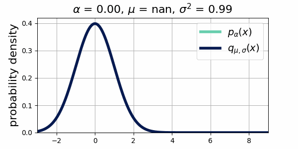

# Mode Seeking Behavior of Reverse KL-Optimization

The behavior of KL optimization shapes the way we design probabilistic models. It's machine learning "common knowledge" that minimizing reverse KL divergence leads to mode-seeking behavior. In this notebook, we empirically evaluate this claim, showing that it can be an oversimplification.

## Background: Reverse vs. Forward KL

Recall that the KL divergence between two distributions $p(\mathbf{x})$ and $q(\mathbf{x})$ is defined by

$$
    \text{KL}(p(\mathbf{x}) || q(\mathbf{x})) = \mathbb{E}_{\mathbf{x} \sim p(\mathbf{x})} \left[\log\left(\frac{p(\mathbf{x})}{q(\mathbf{x})}\right)\right] = \int p(\mathbf{x}) \log \left(\frac{p(\mathbf{x})}{q(\mathbf{x})}\right) d\mathbf{x}.
$$

When approximating a fixed distribution $p(\mathbf{x})$ with a variational distribution $q_\theta(\mathbf{x})$ via KL minimization, we intuitively expect different behaviors depending on the "direction" of the KL loss:

- **Forward KL:** Optimizing for $\text{argmin}_\theta \text{KL}(p(\mathbf{x}) || q_\theta(\mathbf{x}))$ forces $q_\theta(\mathbf{x})$ to include all areas for which $p(\mathbf{x})$ assigns non-zero mass, resulting in mode covering behavior.

- **Reverse KL:** Optimizing for $\text{argmin}_\theta \text{KL}(q_\theta(\mathbf{x}) || p(\mathbf{x}))$ forces $q_\theta(\mathbf{x})$ to exclude all the areas for which $p(\mathbf{x})$ is zero, resulting in mode seeking behavior with $q_\theta(\mathbf{x})$ assigning mass to few parts of the space, near $p(\mathbf{x})$'s modes.

For a deeper overview, see [Murphy's "Probabilistic Machine Learning: An Introduction"](https://probml.github.io/pml-book/book1.html) or [our recent paper](https://www.arxiv.org/pdf/2408.05496).

We take a closer look at the mode-seeking behavior of reverse KL minimization, empirically evaluating it in the case of approximating a Gaussian mixture 

$$
p_\alpha(\mathbf{x}) = \frac{1}{2} \mathcal{N}(\mathbf{x}; \mathbf{0}, I) + \frac{1}{2} \mathcal{N}(\mathbf{x}; \mathbf{u}_\alpha, I), 
$$

with a single variational Gaussian

$$
q_\theta(\mathbf{x}) = q_{\boldsymbol{\mu}, \boldsymbol{\Sigma}}(\mathbf{x})  = \mathcal{N}(\mathbf{x}; \boldsymbol{\mu}, \boldsymbol{\Sigma}).
$$

We demonstrate that mode seeking behavior does arise, but only when the modes of the target distribution are sufficiently far apart.

  

